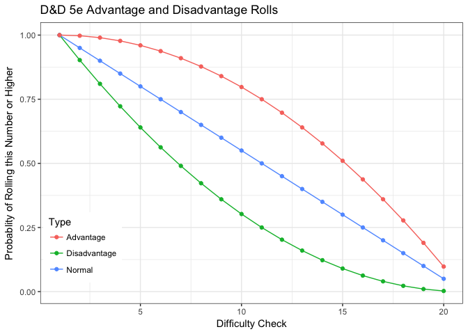

DnD Probs
================
Carmen
11/3/2017

DND Probs
---------

In DND, players roll a 20 sided dice to determine if their actions are successful. The number they roll is contested by a difficulty check. If the player rolls a number higher than the difficulty check, the action is successful. For example, attempting to sneak past a gaurd might call for a player to roll a 15 of higher. DND 5e has a new mechanic that allows players to roll the dice twice, and take the higher of the number. Analysis of the impact of this mechanic follows:

