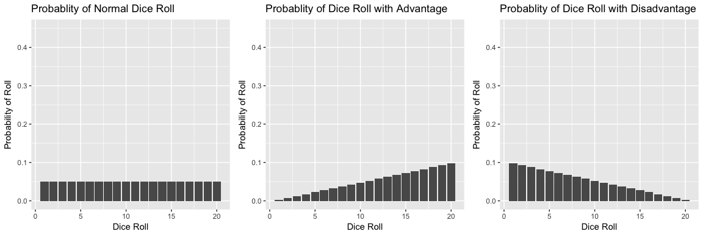
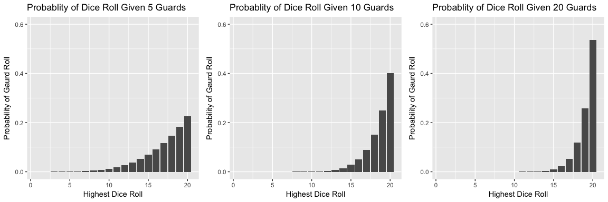
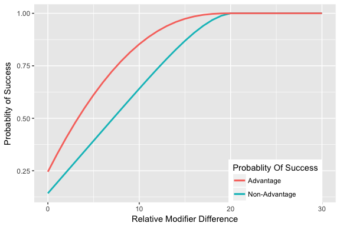

DND Probs
---------

In DND, players roll a 20 sided dice to determine if their actions are successful. The number they roll is contested by a difficulty check. If the player rolls a number higher than the difficulty check, the action is successful. For example, attempting to sneak past a guard might call for a player to roll a 15 or higher. /n Within the newest edition of DnD, there is a mechanic called advantage and disadvantage. They let the player roll the dice two times and take either the higher or the lower of the two numbers as their roll, respectively. /n Below we see the probablity distrobutions for rolling a certain number given a roll with advantage, disadvantage, or under normal circumstances.

#### Probablity of Dice Rolls

Sometimes, you aren't rolling against a single number to determine if you are successful, but many numbers. In the case of a rogue sneaking past many guards, the rogue will roll a dice vs every single guards roll. /n We know the probablity of a player rolling a certain numbers, now we need to determine given N number of guards what is the probability of at least one of the guards rolling a certain number. Below we will show the probabilities for rolling values given 5, 10 and, 15

We have the probabilities of the player rolling certain values, and the probabilities of the guards rolling certain values. We need one more piece of information. Each character has a modifier to the rolls they make. We don't need to know each modifier, but we do need to know how much better the rogue is at sneaking than they guards are at perception. The graph below shows the rogue's probability of success for every relative difference in the difference between the guard and the rogue's modifiers.

